# Calculate Model ROI with Cloudera AI Model Metrics Store and Python SDK

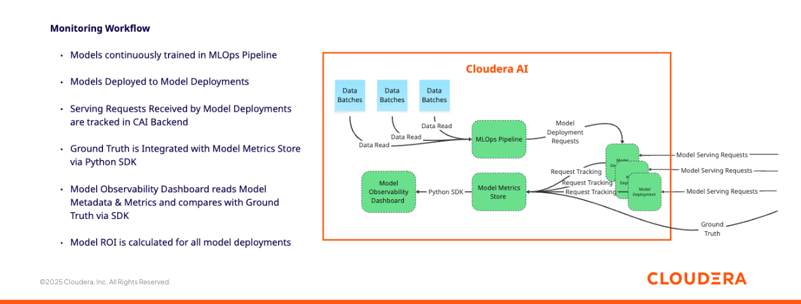

## Objective

In this demo/tutorial you will track financial ROI related to ten different models with a Model Monitoring dashboard, and simulate different Net Revenue scenarios for each of the models by experimenting with each classifier's decision threshold.

## Motivation

Understanding ROI associated with each model deployment is a crucial aspect of AI Observability in the Enterprise.

Just because a model is accurate it doesn't mean it is going to make decisions that lead to the highest revenue or to meeting business objectives. When building a production classifier you must have a close understanding of how many predictions result in True and False Negatives and Positives, so that you can associate each category with financial benefits and costs.  

With Cloudera AI, you can track every model request and ground truth via a dedicated backend Postgres database. And you can build advanced model monitoring capabilities via the integrated SDK, resulting in optimized business decisions and ROI.

## Understanding the Dashboard

Navigate to the Applications tab and open the dashboard. Notice the four inputs fields at the top. These allow you to simulate how much financial income and cost is associated with your predictions.

True Positives and True Negatives are predictions that were correctly classified in the respective category. These bring money in.

False positives are predictions that incorrectly classified an event as taking place when it in fact didn't, such as when a loan applicant was predicted to be likely to default and was therefore denied for a loan, when in fact the applicant did not default on the loan.

False negatives are predictions that incorrectly classified an event as not taking place when it in fact did, such as when a loan applicant was predicted not to be likely to default and was therefore approved for a loan, when in fact the applicant did default on the loan.

In both cases False Positives and Negatives are mistakes and lead to either a real loss or an opportunity cost. Generally, there is a trade off between False Negatives and False Positives. This trade off can be increased or decreased via the decision threshold. Lowering the threshold makes the model more aggressive, predicting more positives, which may capture more true positives but also increases false positives. Viceversa, increasing the threshold leads to more negative predictions, which will likely capture more true negatives but also incur in more false negatives.

Each business scenario is different, and at times it might be ok for an enterprise to have many False Positives and fewer False Negatives, as long as the False Positives don't incur in a high penalty. In other situations, it might be more preferable to have few False Positives in exchange for more False Negatives.

In this scenario we price in a financial penalty for False Positives, and a financial benefit for True Positives and True Negatives. In addition, we also price in a fixed cost of running the models.

Start with the default values in each of the four fields and explore the Dashboard. Navigate to the lower end of the dashboard and notice the comparison between each model's revenue. It looks like BEWNX is going to bring in the most revenue.  

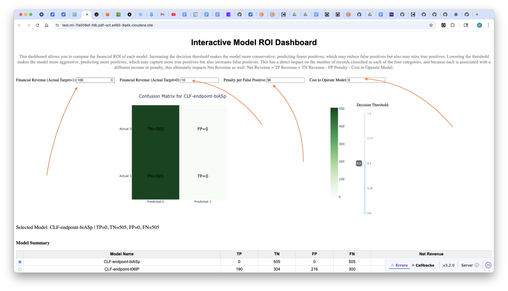

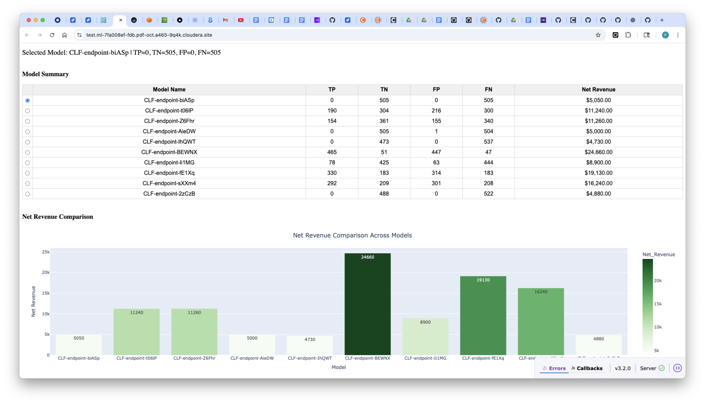

Now modify the values in each of the four boxes. The data and models are generated and trained stochastically so your results on your screen will be different than what is shown in these screenshots. In any case, try increasing the value for Actual Target 1 (TP) to 1000, Actual Target 0 (TN) to 100, and increase the Penalty for False Positives to 5000. Finally, increase the operating cost to 1000.

Notice how ROI measure completely shift, with most models now in negative ROI territory and just a few exceptions.


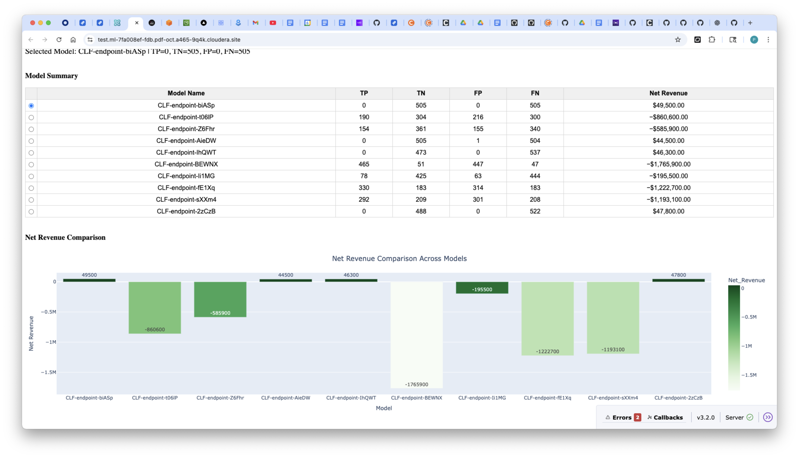

Now try decreasing the Decision Threshold to a very low value. All models are now going to be losing money.


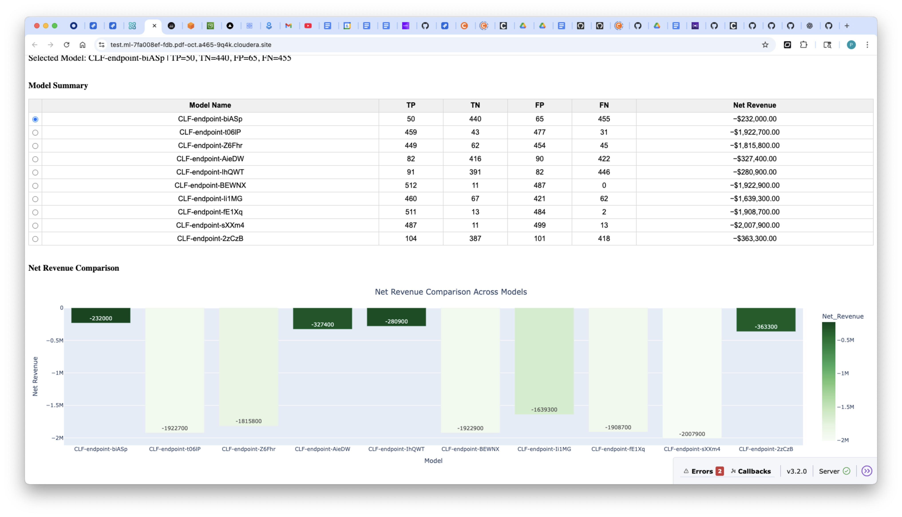

Now increase the Threshold to nearly the max. Most models are now in the positive ROI range.


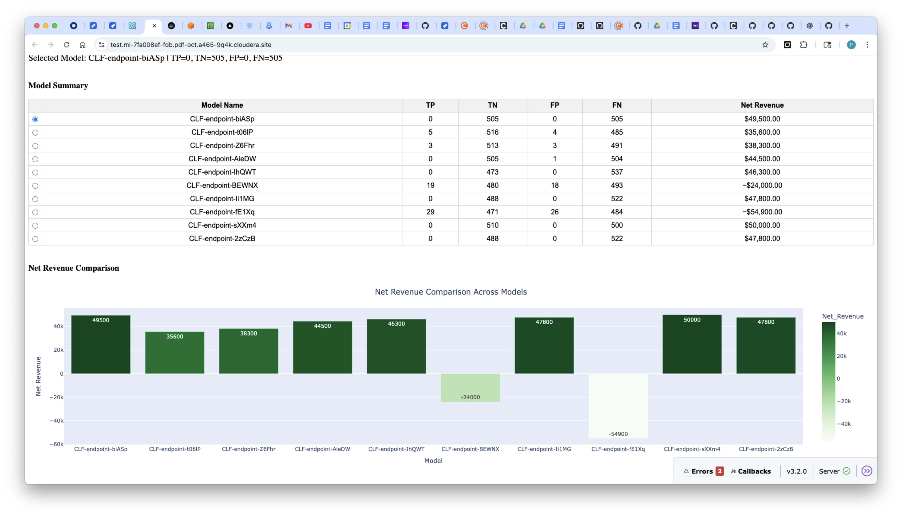

To better understand each model's decisions, select a model in the Table at the center of the screen and observe that the Confusion Matrix is updated. The Confusion Matrix shows how each model places events in each of the four categories. Again, try changing the Decision Threshold and observe that the counts in each of the four categories are updated.

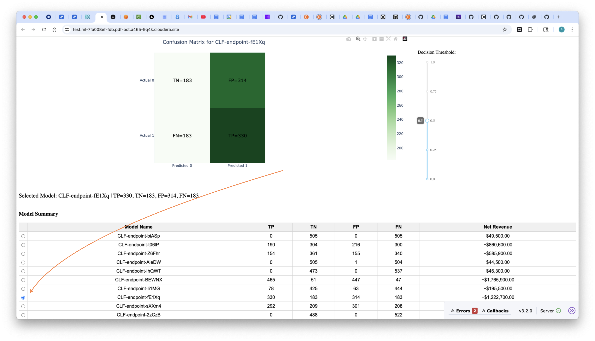

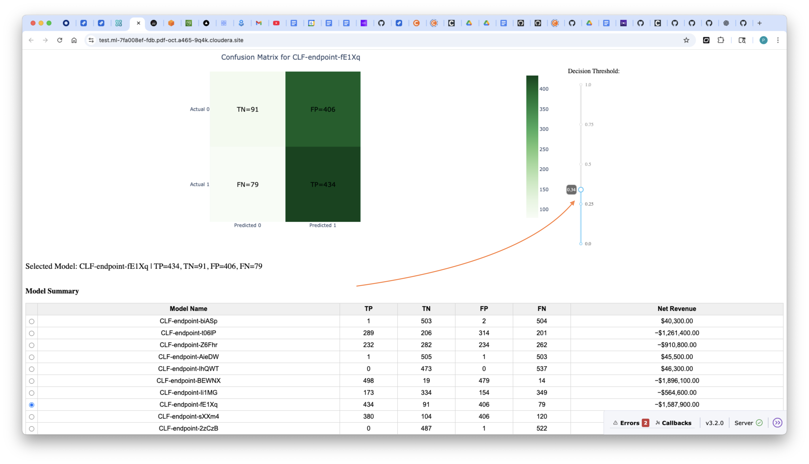

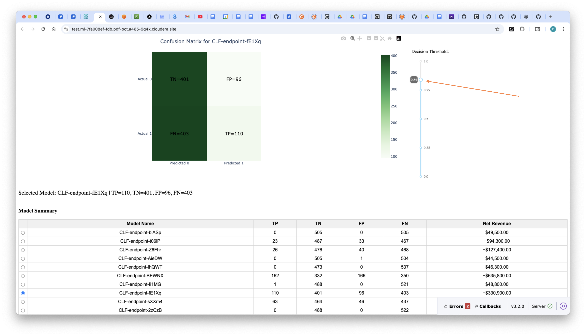

## Requirements

This example was built with Cloudera Public Cloud 7.3.1 and CAI Workbench 2.0.53. The same example will also work in Private Cloud without any changes. You can reproduce this tutorial in your CAI environment with the PBJ Editor Python 3.10 Cloudera AI Runtime.

### Tutorial

All artifacts are included in this Git repository. You can clone or fork it as needed. https://github.com/pdefusco/CAI_Inf_Service_Articles.git

#### 1. Clone the Git Repository as a CAI Project

Create a project with the following entries:

```
Project Name: Financial ROI Dashboard
Project Description: Project to monitor and compare ROI across multiple models.
Initial Setup: -> GIT -> HTTPS -> https://github.com/pdefusco/CAI_Dashboards.git
Runtimes:
  PBJ	Python 3.10	Standard 2025.09.01
```

#### 2. Create the Project Environment Variables

Navigate to User Settings -> Environment Variables and then save the following Environment Variables:

```
SPARK_CONNECTION_NAME: <obtain-via-data-connections-ui>
DBNAME_PREFIX: <arbitrary>
```

#### 3. Launch a CAI Session and Install Requirements

Launch your first CAI Session with PBJ Runtime. You won't need a lot of resources:

```
Kernel: Python 3.10 PBJ Workbench Standard
Resource Profile: 2 vCPU / 4 iGB Mem / 0 GPU
```

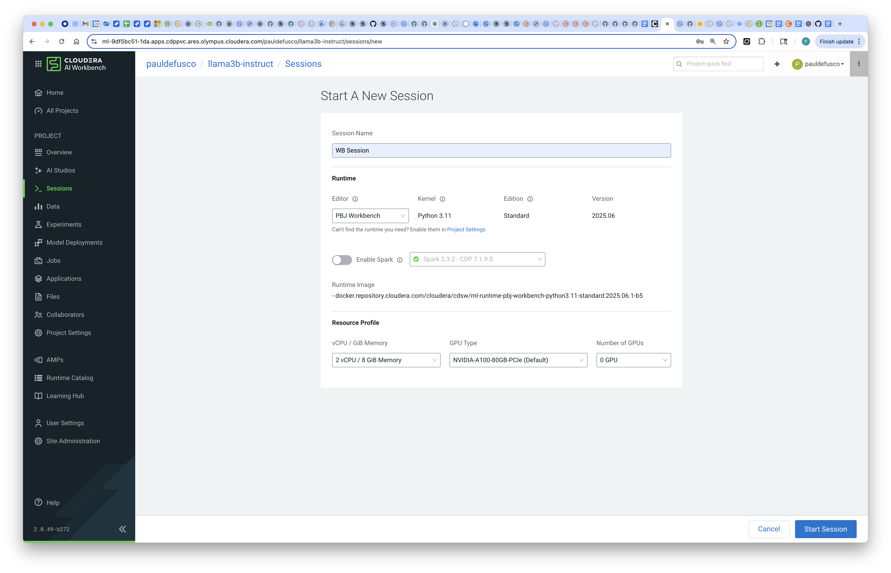

Install the requirements by opening the Terminal and running this command:

```
pip3 install -r requirements.txt
```

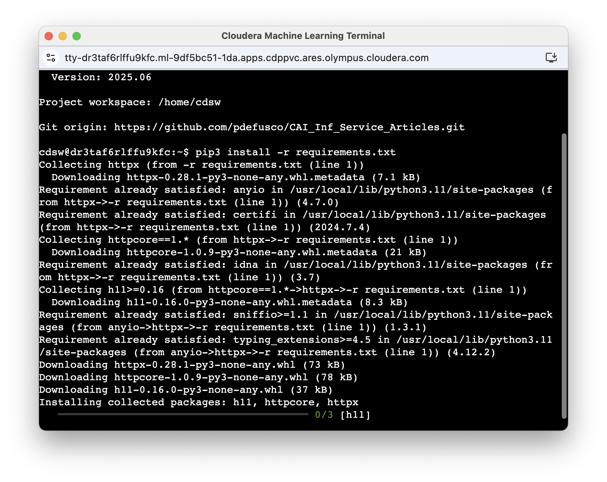

#### 4. Create and Run the MLOps Pipeline Job

Create the MLOps Pipeline Job. The job will automatically create and run all the jobs and model deployments needed in order to prefill the backend infrastructure with ten models and 1000 synthetic requests to each model. The Pipeline will finally also deploy the Dashboard for you.

```
Name: MLOps Pipeline
Kernel: Python 3.10 PBJ Workbench Standard
Resource Profile: 4 vCPU / 8 iGB Mem / 0 GPU
Script: model_roi/05_Pipeline.py
Schedule: Manual
```

Run the job. The job will run for approximately 30 minutes. When it is done, your Project Overview will show ten model endpoints and thirty job runs.

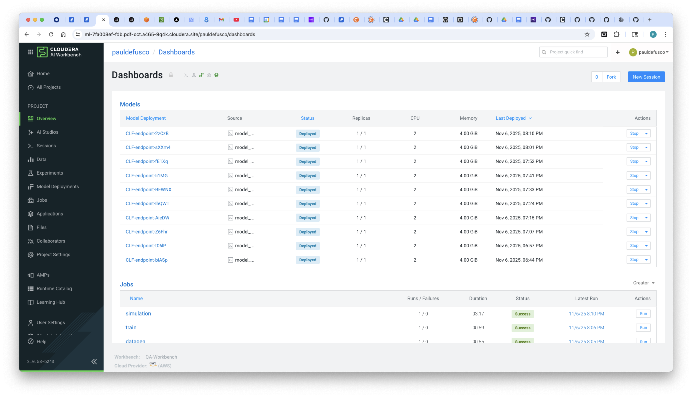

#### 5. Explore the Dashboard

Use the "Understanding the Dashboard" section above to simulate and compare different financial ROI scenarios.

If you want to familiarize yourself with the Python SDK, open the scripts and notice the following highlights:

##### 03_simulation.py

Every Workbench has an integrated API. Models can be referenced by model metadata which can be obtained via the API ("cml apiV2").

```
client = cmlapi.default_client()
```

In this script a sample from the original data is taken in order to generate synthetic data requests. The SDK Call Model method is used in order to submit this sample as requests to the endpoint.

```
cdsw.call_model(Model_AccessKey, record)
```

##### 06_live_model_roi_dashboard.py

The same API client can be used to generate dataframes with the tracked model endpoint requests and responses.

```
for model in range(len(listModelsResponse.models)):
    modelName = listModelsResponse.models[model].name
    Model_CRN = apiUtil.get_latest_deployment_details(model_name=modelName)["model_crn"]
    Deployment_CRN = apiUtil.get_latest_deployment_details(model_name=modelName)["latest_deployment_crn"]

    model_metrics = cdsw.read_metrics(model_crn=Model_CRN, model_deployment_crn=Deployment_CRN)

    record = {
        "model_name": modelName,
        "model_crn": Model_CRN,
        "deployment_crn": Deployment_CRN
    }
    if isinstance(model_metrics, dict):
        record.update(model_metrics)
    all_models_data.append(record)

df = pd.json_normalize(all_models_data)
```

Users can arbitrarily define which metrics to track. In this example, the "final_label" field tracks ground truth ("what actually happened"); Predictions are tracked via the "y_pred" field; Finally, the "probability" field is used to also track the probability of the event belonging to the predicted class. This field will be later used in the same dashboard to model the decision threshold, thus moving records from one class to the other.

```
records = []
for _, row in df.iterrows():
    model_name = row.get("model_name")
    model_crn = row.get("model_crn")
    metrics_list = row.get("metrics", [])

    if not isinstance(metrics_list, list):
        continue

    for request in metrics_list:
        flat = {
            "model_name": model_name,
            "final_label": request.get("metrics", {}).get("final_label"),
            "probability": request.get("metrics", {}).get("probability"),
            "y_pred": request.get("metrics", {}).get("y_pred")
        }
        records.append(flat)

metrics_flat_df = pd.DataFrame(records)
```

## Summary & Next Steps

In this tutorial, we demonstrated how to leverage the Cloudera AI SDK in order to build a Model ROI Observability Dashboard. While this was a basic example, the same approach could be taken to track more models, with more predictions, across one more multiple use cases, and in the context of more advanced MLOps pipelines where decisions are taken as a result of different ROI results.  

This end-to-end workflow highlights how Cloudera AI simplifies the process of operationalizing Model Observability Dashboards.

### Links to Relevant Blogs and Articles

* [Deploy and Scale AI Applications With Cloudera AI Inference Service](https://www.cloudera.com/blog/business/deploy-and-scale-ai-applications-with-cloudera-ai-inference-service.html) – October 8 2024. Describes how Cloudera’s AI Inference service enables production‑grade deployment of AI applications and scalable model serving. ([Cloudera][1])
* [Introducing Cloudera’s AI Assistants](https://www.cloudera.com/blog/business/introducing-clouderas-ai-assistants.html) – June 24 2024. Discusses AI‑applications built into Cloudera, including ML copilots and data/BI assistants. ([Cloudera][2])
* [Introducing MLOps And SDX for Models in Cloudera Machine Learning](https://www.cloudera.com/blog/technical/introducing-mlops-and-sdx-for-models-in-cloudera-machine-learning.html) – Foundational article covering model metrics store, SDK, tracking for models in CML. ([Cloudera][3])
* [Announcing General Availability of Model Registry](https://www.cloudera.com/blog/technical/announcing-general-availability-of-model-registry.html) – Nov 29 2023. Talks about Cloudera’s Model Registry, versioning, SDK (MLflow), model metadata and lifecycle. ([Cloudera][4])
* [Enabling Model Metrics (Cloudera Documentation)](https://docs.cloudera.com/machine-learning/1.5.5/model-metrics/topics/ml-enabling-model-metrics.html) – Documentation on how to enable the metrics store in Cloudera AI, track predictions & metrics over time. ([Cloudera Documentation][5])
* [Model Registry API & SDK Documentation](https://docs.cloudera.com/machine-learning/cloud/rest-api-reference-ai-registry/index.html) – Reference for model registry REST API and Python/SDK usage. ([Cloudera Documentation][6])
* [Cloudera AI Overview – Applications & Workbenches](https://docs.cloudera.com/machine-learning/cloud/product/topics/ml-product-overview.html) – Describes Cloudera AI Workbench, analytical applications, how models and apps are integrated. ([Cloudera Documentation][7])

[1]: https://www.cloudera.com/blog/business/deploy-and-scale-ai-applications-with-cloudera-ai-inference-service.html?utm_source=chatgpt.com "Deploy and Scale AI Applications With Cloudera AI Inference Service | Blog | Cloudera"
[2]: https://www.cloudera.com/blog/business/introducing-clouderas-ai-assistants.html?utm_source=chatgpt.com "Introducing Cloudera's AI Assistants | Blog | Cloudera"
[3]: https://www.cloudera.com/blog/technical/introducing-mlops-and-sdx-for-models-in-cloudera-machine-learning.html?utm_source=chatgpt.com "Introducing MLOps And SDX for Models in Cloudera Machine Learning"
[4]: https://www.cloudera.com/blog/technical/announcing-general-availability-of-model-registry.html?utm_source=chatgpt.com "Announcing General Availability of Model Registry | Blog | Cloudera"
[5]: https://docs.cloudera.com/machine-learning/1.5.5/model-metrics/topics/ml-enabling-model-metrics.html?utm_source=chatgpt.com "Enabling model metrics"
[6]: https://docs.cloudera.com/machine-learning/cloud/rest-api-reference-ai-registry/index.html?utm_source=chatgpt.com "Model Registry"
[7]: https://docs.cloudera.com/machine-learning/cloud/product/topics/ml-product-overview.html?utm_source=chatgpt.com "Cloudera AI overview"
